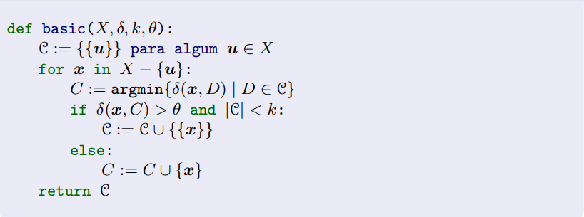
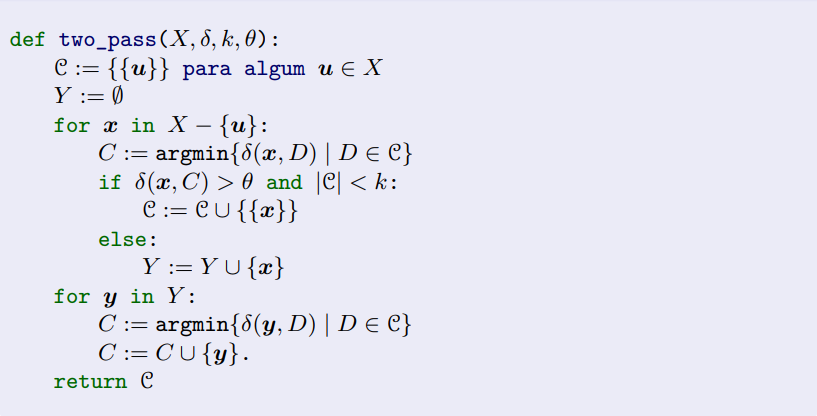

# Prova de Inteligência Artificial USJT

## Proposta

Implementar os algoritmos basic e two_pass apresentados na nota de aula sobre algoritmos de agrupamento.
Façam os testes com os dados do arquivo iris.txt e compare a performance destes algoritmos com o 
kmeans visto em aula. A implementação poderá ser feita tanto em Java quanto em Python.

## Algoritmos

